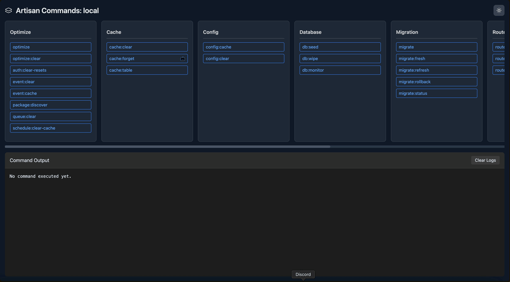

# Artisan Command Palette UI

[](https://github.com/laravel-ready/artisan-command-palette-ui)

[![Stable Version][badge_stable]][link_packagist]
[![Unstable Version][badge_unstable]][link_packagist]
[![Total Downloads][badge_downloads]][link_packagist]
[![License][badge_license]][link_license]

A beautiful UI for Laravel Artisan commands that provides a command palette interface to search and execute Artisan commands directly from your browser.

## 🖼️ Preview



## 📦 Installation

You can install the package via composer:

```bash
composer require laravel-ready/artisan-command-palette-ui
```

## ⚙️ Configuration

Publish the configuration file:

```bash
php artisan vendor:publish --provider="LaravelReady\ArtisanCommandPaletteUI\ArtisanCommandPaletteUIServiceProvider" --tag="config"
```

This will create a `config/artisan-command-palette-ui.php` file where you can modify the package settings.

## 🚀 Usage

After installation, you can access the command palette UI at `/artisan-command-palette` (or the custom route prefix you defined in the config).

The UI allows you to:

- Search for available Artisan commands
- View command descriptions and signatures
- Execute commands and see their output in real-time

## 🔒 Security

By default, the command palette is protected by the `auth` middleware, meaning only authenticated users can access it.

For additional security:

- The package is disabled in production environments by default (can be enabled in config)
- You can exclude sensitive commands in the config file

## 💻 Frontend Development

If you want to modify the frontend assets, you can publish the views:

```bash
php artisan vendor:publish --provider="LaravelReady\ArtisanCommandPaletteUI\ArtisanCommandPaletteUIServiceProvider" --tag="views"
```

## 🧪 Testing

To run the test suite, you can use the following command:

```bash
composer test
```

## 📄 License

The MIT License (MIT). Please see [License File](LICENSE.md) for more information.

[badge_downloads]:      https://img.shields.io/packagist/dt/laravel-ready/artisan-command-palette-ui.svg?style=flat-square

[badge_license]:        https://img.shields.io/packagist/l/laravel-ready/artisan-command-palette-ui.svg?style=flat-square

[badge_stable]:         https://img.shields.io/github/v/release/laravel-ready/artisan-command-palette-ui?label=stable&style=flat-square

[badge_unstable]:       https://img.shields.io/badge/unstable-dev--main-orange?style=flat-square

[link_license]:         LICENSE

[link_packagist]:       https://packagist.org/packages/laravel-ready/artisan-command-palette-ui
